# DP100-Azure Data Scientist Associate
 Manage data ingestion and preparation, model training and deployment, and machine learning solution monitoring with Python, Azure Machine Learning and MLflow.

---
---

# 1. Design a machine learning solution

## 1.1 Design a data ingestion strategy for machine learning projects


**Six steps to plan, train, deploy, and monitor the model:**
- Define the problem
- Get the data
- Prepare the data
- Train the model
- Integrate the model
- Monitor the model

**Three different formats:**
- **Tabular or structured data** - *an Excel or CSV file*
- **Semi-structured data** - *JSON object*
- **Unstructured data** - *documents, images, audio, and video files*

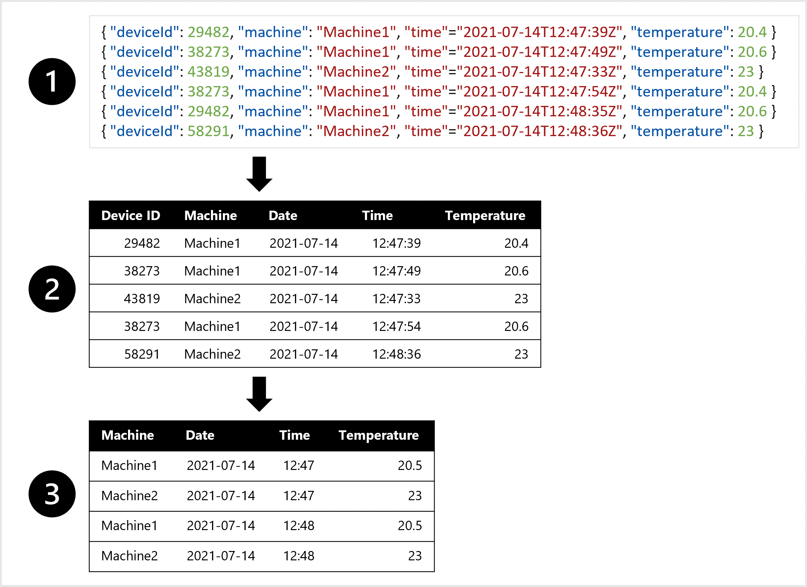

**Three common options for storing data:**
- **Azure Blob Storage** - Cheapest option for storing data as unstructured data. Ideal for storing files like images, text, and JSON.
- **Azure Data Lake Storage (Gen 2)** - *advanced version of the Azure Blob Storage*. Also stores files like CSV files and images as unstructured data. *Storage capacity is virtually limitless so ideal for storing large data.*
- **Azure SQL Database** - Stores data as structured data. *Ideal for data that doesn’t change over time.*

**To create a data ingestion pipeline:**
- **Azure Synapse Analytics** - create and run pipelines for data ingestion.
- **Azure Databricks** - uses Spark clusters, which distribute the compute to transform large amounts of data in less time.
- **Azure Machine Learning** - provides compute clusters, which automatically scale up and down when needed.

> ***Data transformations may perform better when you execute them with either Azure Synapse Analytics or Azure Databricks instead of using Azure Machine Learning.***

**Common approach for a data ingestion solution:**
- Extract raw data from its source (like a CRM system or IoT device).
- Copy and transform the data with Azure Synapse Analytics.
- Store the prepared data in an Azure Blob Storage.
- Train the model with Azure Machine Learning.

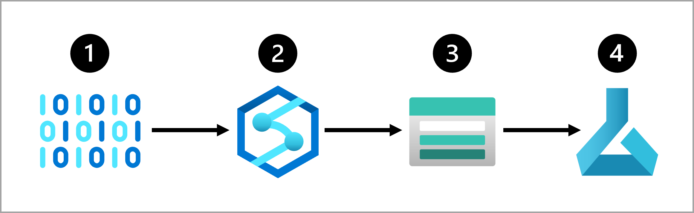

---

## 1.2 Design a machine learning model training solution

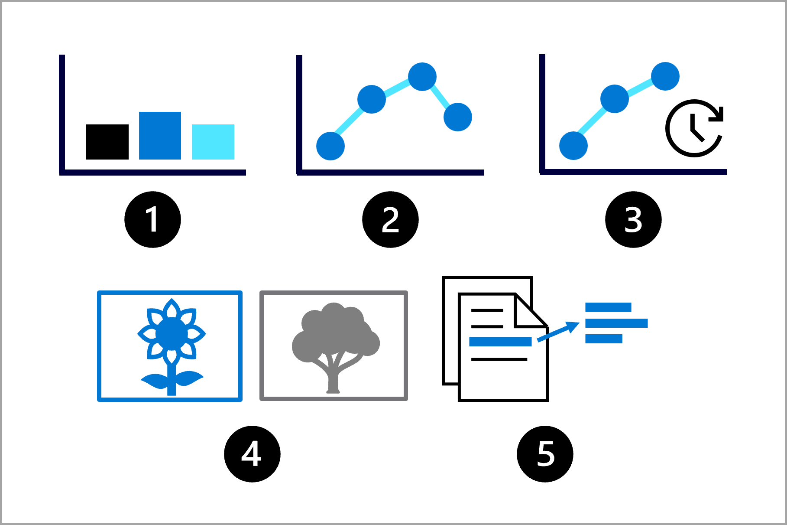

**Some common machine learning tasks are:**
- **Classification:** Predict a categorical value.
- **Regression:** Predict a numerical value.
- **Time-series forecasting:** Predict future numerical values based on time-series data.
- **Computer vision:** Classify images or detect objects in images.
- **Natural language processing (NLP):** Extract insights from text.

**Multiple services would fit your scenario:**
- Customizable prebuilt models suits your requirements - **Azure AI Services**
- Keep all data-related (data engineering and data science) projects within the same service - **Azure Synapse Analytics or Azure Databricks**
- Need distributed compute for working with large datasets (Large datasets & Work with PySpark) - **Azure Synapse Analytics or Azure Databricks**
- Full control over model training and management - **Azure Machine Learning or Azure Databricks**
-  Python is your preferred programming language - **Azure Machine Learning**
-  User interface to manage your machine learning lifecycle - **Azure Machine Learning**

> A Spark cluster consists of a driver node and worker nodes.
**To make optimal use of a Spark cluster**, your code needs to be written in a **Spark-friendly language like Scala, SQL, RSpark, or PySpark** in order to distribute the workload. If you **write in Python**, **you’ll only use the driver node** and leave the worker nodes unused.

---

## 1.3 Design a model deployment solution

**When you deploy a model to an endpoint, you have two options:**
- **real-time predictions** - Recommendations based on user search like tshirt recommend while browsing.
- **batch predictions** - Recommendations based on historal data like predict orange juice sales in future weeks.

> ***Containers will be the more cost-effective solution as we want the model to be always available and respond immediately.***

---

## 1.4 Design a machine learning operations solution

**To prepare the model and operationalize it, you want to:**
- Convert the model training to a robust and reproducible pipeline.
- Test the code and the model in a development environment.
- Deploy the model in a production environment.
- Automate the end-to-end process.

**MLOps Architecture:**
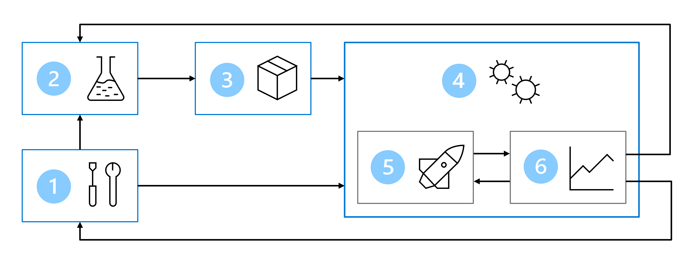

Monitoring is beneficial in any MLOps environment.

> Model's predictions trained on older data less accurate.This change in data profiles between current and the training data is known as ***data drift***

> ***Important to be able to monitor data drift over time, and retrain models as required to maintain predictive accuracy.***

**Two approaches to when you want to retrain a model:**
- **Based on a schedule**
- **Based on metrics**

*When the model's performance is below the benchmark, we should retrain the model.*

> Two tools used in MLOps projects are **Azure DevOps** and **GitHub (Actions)**. 

---
---

# 2. Explore and configure the Azure Machine Learning workspace

## 2.1 Explore Azure Machine Learning workspace resources and assets

> - Azure administrators group to create compute targets and datastores
> - Data scientists group can create and run jobs to train models, and register models.

**Resources and resource groups to assign permissions to other users:**
- **Owner**
- **Contributor**
- **Reader**

**Azure Machine Learning has specific built-in roles you can use:**
- **AzureML Data Scientist:** Can perform all actions within the workspace, except for creating or deleting compute resources, or editing the workspace settings.
- **AzureML Compute Operator:** Is allowed to create, change, and manage access the compute resources within a workspace.

**Five types of compute in the Azure Machine Learning workspace:**
- Compute instances
- Compute clusters
- Kubernetes clusters
- Attached computes
- Serverless compute

**Four datastores already added to your workspace:**
- workspaceartifactstore
- workspaceworkingdirectory
- workspaceblobstore
- workspacefilestore

**To train models with the Azure Machine Learning workspace, you have several options:**
- Use Automated Machine Learning.
- Run a Jupyter notebook.
- Run a script as a job.

**There are different types of jobs depending on how you want to execute a workload:**
- **Command:** Execute a single script.
- **Sweep:** Perform hyperparameter tuning when executing a single script.
- **Pipeline:** Run a pipeline consisting of multiple scripts or components.

## 2.2 Explore developer tools for workspace interaction

**Azure Machine Learning studio access:**
- **Author:** Create new jobs to train and track a machine learning model.
- **Assets:** Create and review assets you use when training models.
- **Manage:** Create and manage resources you need to train models.

**Create a new job to train a model:**
```python
from azure.ai.ml import command
# configure job
job = command(
    code="./src",
    command="python train.py",
    environment="AzureML-sklearn-0.24-ubuntu18.04-py37-cpu@latest",
    compute="aml-cluster",
    experiment_name="train-model"
)
# connect to workspace and submit job
returned_job = ml_client.create_or_update(job)
```

**Azure CLI allows you to:**
- Automate the creation and configuration of assets and resources to make it repeatable.
- Ensure consistency for assets and resources that must be replicated in multiple environments (for example, development, test, and production).
- Incorporate machine learning asset configuration into developer operations (DevOps) workflows, such as continuous integration and continuous deployment (CI/CD) pipelines.

## 2.3 Make data available in Azure Machine Learning

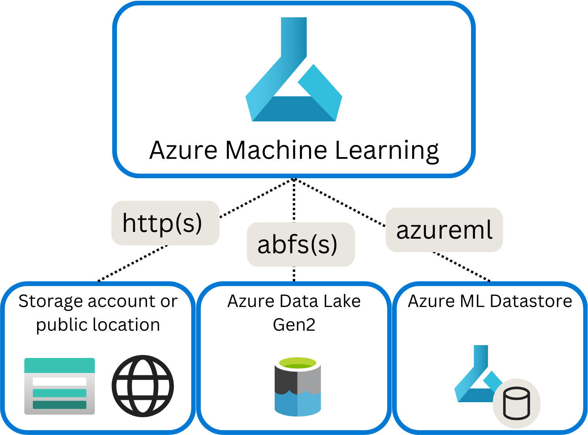
**Data Store location:**
- **http(s):** Use for data stores publicly or privately in an Azure Blob Storage or publicly available http(s) location.
- **abfs(s):** Use for data stores in an Azure Data Lake Storage Gen 2.
- **azureml:** Use for data stored in a datastore.

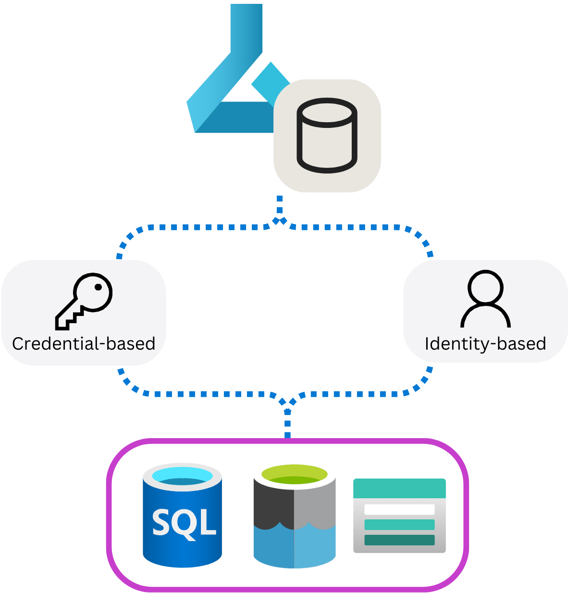
**Access granted permission:**
- **Credential-based:** Use a service principal, shared access signature (SAS) token or account key to authenticate access to your storage account.
- **Identity-based:** Use your Microsoft Entra identity or managed identity.

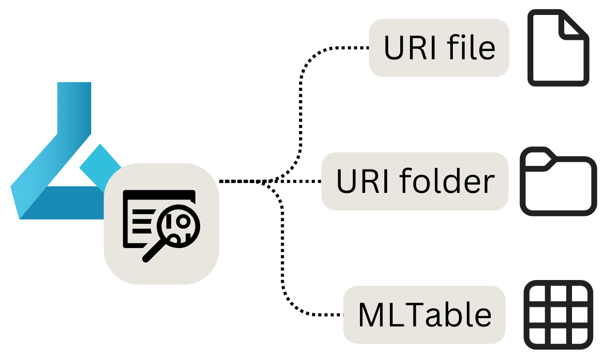
**Access file/data from location:**
- **URI file:** Points to a specific file.
- **URI folder:** Points to a folder.
- **MLTable:** Points to a folder or file, and includes a schema to read as tabular data.

> ***MLTable** is ideal when the schema changes frequently. Then, you only need to make changes in one location instead of multiple.*

**To create a URI file data asset:**
```python
from azure.ai.ml.entities import Data
from azure.ai.ml.constants import AssetTypes
my_path = '<supported-path>'
my_data = Data(
    path=my_path,
    type=AssetTypes.URI_FILE,
    description="<description>",
    name="<name>",
    version="<version>"
)
ml_client.data.create_or_update(my_data)
```

## 2.4 Work with compute targets in Azure Machine Learning

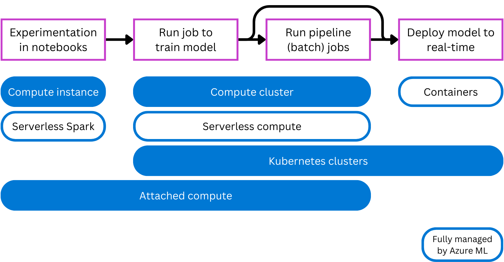

**To create a compute cluster with the Python SDK:**
```python
from azure.ai.ml.entities import AmlCompute
cluster_basic = AmlCompute(
    name="cpu-cluster",
    type="amlcompute",
    size="STANDARD_DS3_v2",
    location="westus",
    min_instances=0,
    max_instances=2,
    idle_time_before_scale_down=120,
    tier="low_priority",
)
ml_client.begin_create_or_update(cluster_basic).result()
```
**When you create a compute cluster, there are three main parameters:**
- **size** - Specifies the virtual machine type of each node within the compute cluster
- **max_instances** - Specifies the maximum number of nodes your compute cluster can scale out to.
- **tier** - Specifies whether your virtual machines are low priority or dedicated

**Three main scenarios in which you can use a **compute cluster**:**
- Running a pipeline job you built in the Designer.
- Running an Automated Machine Learning job.
- Running a script as a job.

> *By increasing the idle time before scale down, you can run multiple pipelines consecutively without the compute cluster resizing to zero nodes in between jobs.*

## 2.5 Work with environments in Azure Machine Learning

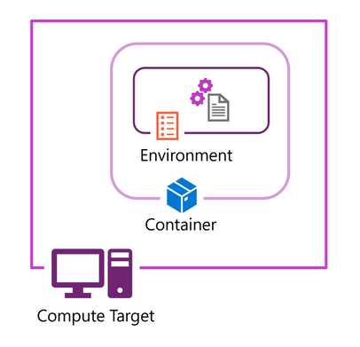

**Retrieve an environment by its registered name:**
```python
env = ml_client.environments.get(name="my-environment", version="1")
print(env)
```
> **Curated environments are ideal to use for faster development time.**

---

# 3. Experiment with Azure Machine Learning

## 3.1 Find the best classification model with Automated Machine Learning

**AutoML** applies scaling and normalization to numeric data automatically, helping prevent any large-scale features from dominating training.

- By default, AutoML will perform featurization on your data.

***AutoML** needs a MLTable data asset as input. In the example, my_training_data_input refers to a MLTable data asset created in the Azure Machine Learning workspace.*

## 3.2 Track model training in Jupyter notebooks with MLflow

**MLflow** is an open-source library for tracking and managing your machine learning experiments.

- The *mlflow* package is the open-source library. The *azureml-mlflow* package contains the integration code of Azure Machine Learning with MLflow.

- MLflow supports automatic logging for popular machine learning libraries

- You can use **autologging with scikit-learn**. Enabling autologging will minimize the effort needed to log the model's results.

- Jobs will show the **MLflow experiment runs** including all metadata and logged parameters, metrics, and artifacts.

---

# 4. Optimize model training with Azure Machine Learning

## 4.1 Run a training script as a command job in Azure Machine Learning

***Scripts are ideal for testing and automation in your production environment.* To create a production-ready script:**
- Remove nonessential code.
- Refactor your code into functions.
- Test your script in the terminal.

**You can configure a command job to run a file named *train.py*, on the compute cluster named *aml-cluster* with the following code:**
```python
from azure.ai.ml import command
# configure job
job = command(
    code="./src",
    command="python train.py",
    environment="AzureML-sklearn-0.24-ubuntu18.04-py37-cpu@latest",
    compute="aml-cluster",
    display_name="train-model",
    experiment_name="train-classification-model"
    )
```

> - `command` - To configure a command job
> - `argparse` - To use parameters in a script,

> - To use different values each time, define arguments in the script and pass them using the arguments parameter of the command job.

## 4.2 Track model training with MLflow in jobs

MLflow is an open-source platform, designed to manage the complete machine learning lifecycle.

**Two options to track machine learning jobs with MLflow:**
- Enable autologging using `mlflow.autolog()`
- Use logging functions to track custom metrics using `mlflow.log_*`

**Use the MLflow command to store the metric with the experiment run:**
- `mlflow.log_param()`: Log single key-value parameter. Use this function for an input parameter you want to log.
- `mlflow.log_metric()`: Log single key-value metric. Value must be a number. Use this function for any output you want to store with the run.
- `mlflow.log_artifact()`: Log a file. Use this function for any plot you want to log, save as image file first.

> **Use mlflow.log_metric() to log a metric like the RMSE.**
> **Model assets like the model pickle file will be stored in the model folder under Outputs + logs.**

```python
import mlflow
reg_rate = 0.1
mlflow.log_param("Regularization rate", reg_rate)
```
> MLflow allows you to search for runs inside of any experiment. You need either the experiment ID or the experiment name.

**if you want to sort by start time and only show the last two results:**
```python
mlflow.search_runs(exp.experiment_id, order_by=["start_time DESC"], max_results=2)
```

## 4.3 Perform hyperparameter tuning with Azure Machine Learning

> The set of hyperparameter values tried during hyperparameter tuning is known as the **`search space`**

Some **hyperparameters require discrete values**. You can also select discrete values from any of the following discrete distributions:
- `QUniform(min_value, max_value, q)`: Returns a value like round(Uniform(min_value, max_value) / q) * q
- `QLogUniform(min_value, max_value, q)`: Returns a value like round(exp(Uniform(min_value, max_value)) / q) * q
- `QNormal(mu, sigma, q)`: Returns a value like round(Normal(mu, sigma) / q) * q
- `QLogNormal(mu, sigma, q)`: Returns a value like round(exp(Normal(mu, sigma)) / q) * q

**To define a search space for these kinds of value, you can use any of the following distribution types:**
- `Uniform(min_value, max_value)`: Returns a value uniformly distributed between min_value and max_value
- `LogUniform(min_value, max_value)`: Returns a value drawn according to exp(Uniform(min_value, max_value)) so that the logarithm of the return value is uniformly distributed
- `Normal(mu, sigma)`: Returns a real value that's normally distributed with mean mu and standard deviation sigma
- `LogNormal(mu, sigma)`: Returns a value drawn according to exp(Normal(mu, sigma)) so that the logarithm of the return value is normally distributed


**To define a search space for hyperparameter tuning, create a dictionary with the appropriate parameter expression for each named hyperparameter.**
```python
from azure.ai.ml.sweep import Choice, Normal
command_job_for_sweep = job(
    batch_size=Choice(values=[16, 32, 64]),    
    learning_rate=Normal(mu=10, sigma=3),
)
```

**Three main sampling methods available in Azure Machine Learning:**
- **Grid sampling**: Tries every possible combination.
- **Random sampling**: Randomly chooses values from the search space.
  - **Sobol**: Adds a seed to random sampling to make the results reproducible.
- **Bayesian sampling**: Chooses new values based on previous results.

**Two main parameters when you choose to use an early termination policy:**
- **evaluation_interval**: Specifies at which interval you want the policy to be evaluated. Every time the primary metric is logged for a trial counts as an interval.
- **delay_evaluation**: Specifies when to start evaluating the policy. This parameter allows for at least a minimum of trials to complete without an early termination policy affecting them.

**To determine the extent to which a model should perform better than previous trials, there are three options for early termination:**
- **Bandit policy**: Uses a slack_factor (relative) or slack_amount(absolute). Any new model must perform within the slack range of the best performing model.
- **Median stopping policy**: Uses the median of the averages of the primary metric. Any new model must perform better than the median.
- **Truncation selection policy**: Uses a truncation_percentage, which is the percentage of lowest performing trials. Any new model must perform better than the lowest performing trials.

## 4.4 Run pipelines in Azure Machine Learning

**Two main reasons why you'd use components:**
- To build a pipeline.
- To share ready-to-go code.

**A component consists of three parts:**
- `Metadata`: Includes the component's name, version, etc.
- `Interface`: Includes the expected input parameters (like a dataset or hyperparameter) and expected output (like metrics and artifacts).
- `Command, code and environment`: Specifies how to run the code.


**To create a component, you need two files:**
- A script that contains the workflow you want to execute.
- A YAML file to define the metadata, interface, and command, code, and environment of the component.

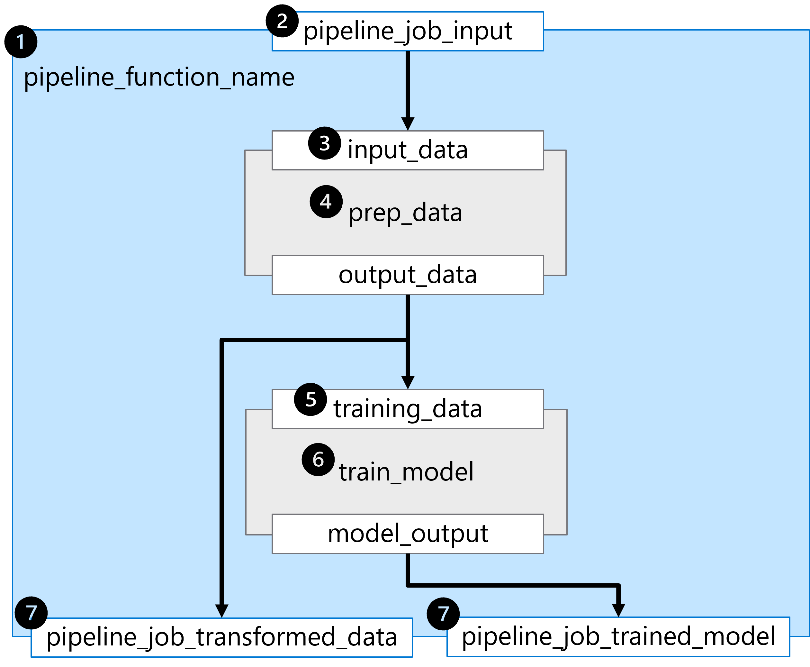

A pipeline is defined in a YAML file, which you can also create using the `@pipeline()` function.

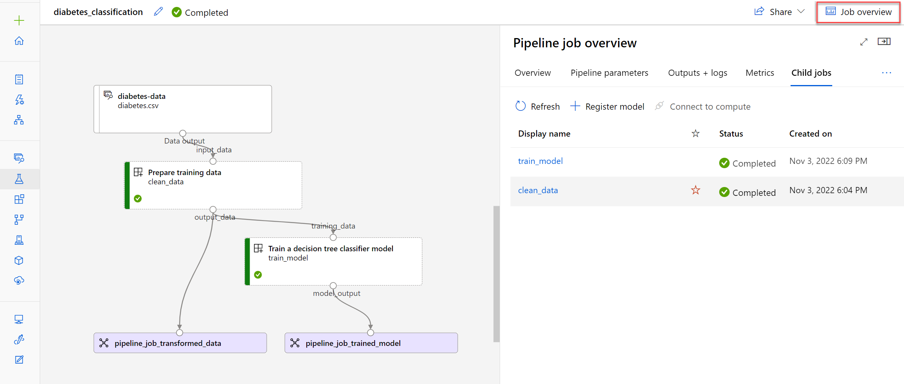

**Various ways to create a schedule:**
- **frequency**
- **interval**

> RecurrenceTrigger class to create a schedule that runs at a regular interval.

**To create a schedule that fires every minute, run the following code:**
```python
from azure.ai.ml.entities import RecurrenceTrigger
schedule_name = "run_every_minute"
recurrence_trigger = RecurrenceTrigger(
    frequency="minute",
    interval=1,
)
```

# 5. Manage and review models in Azure Machine Learning

## 5.1 Register an MLflow model in Azure Machine Learning

When you train and log a model, you store all relevant artifacts in a directory. When you register the model, an `MLmodel` file is created in that directory. The `MLmodel` file contains the model's metadata, which allows for model traceability.

> You want your model to be identified as by using `mlflow.<flavor>.autolog()`

**The MLmodel file may include:**
- `artifact_path`: During the training job, the model is logged to this path.
- `flavor`: The machine learning library with which the model was created.
- `model_uuid`: The unique identifier of the registered model.
- `run_id`: The unique identifier of job run during which the model was created.
- `signature`: Specifies the schema of the model's inputs and outputs:
  - `inputs`: Valid input to the model. For example, a subset of the training dataset.
  - `outputs`: Valid model output. For example, model predictions for the input dataset.

**Two types of signatures:**
- `Column-based`: used for tabular data with a pandas.Dataframe as inputs.
- `Tensor-based`: used for n-dimensional arrays or tensors (often used for unstructured data like text or images), with numpy.ndarray as inputs.

**Three types of models you can register:**
- `MLflow`: Model trained and tracked with MLflow. Recommended for standard use cases.
- `Custom`: Model type with a custom standard not currently supported by Azure Machine Learning.
- `Triton`: Model type for deep learning workloads. Commonly used for TensorFlow and PyTorch model deployments.

## 5.2 Create and explore the Responsible AI dashboard for a model in Azure Machine Learning

**Microsoft has listed five Responsible AI principles:**
- Fairness and inclusiveness
- Reliability and safety
- Privacy and security
- Transparency
- Accountability

**To create a Responsible AI (RAI) dashboard, you need to create a pipeline by using the built-in components. The pipeline should:**
1. Start with the `RAI Insights dashboard constructor`.
1. Include one of the RAI tool components.
1. End with `Gather RAI Insights dashboard` to collect all insights into one dashboard.
1. Optionally you can also add the `Gather RAI Insights score card` at the end of your pipeline.

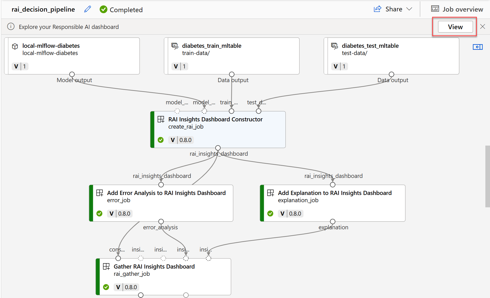

**You can create the Responsible AI dashboard in three ways:**
- Using the Command Line Interface (CLI) extension for Azure Machine Learning.
- Using the Python Software Development Kit (SDK).
- Using the Azure Machine Learning studio for a no-code experience.

**Insights in your Responsible AI dashboard:**
1. Error analysis
1. Explanations
1. Counterfactuals
1. Causal analysis

**Explore error analysis -** 
- `Error tree map`: Allows you to explore which combination of subgroups results in the model making more false predictions.
- `Error heat map`: Presents a grid overview of a model's errors over the scale of one or two features.

**Explore explanations -** 
- `Aggregate feature importance`: Shows how each feature in the test data influences the model's predictions overall.
- `Individual feature importance`: Shows how each feature impacts an individual prediction.

**Causal analysis - **
- `Aggregate causal effects`: Shows the average causal effects for predefined treatment features (the features you want to change to optimize the model's predictions).
- `Individual causal effects`: Shows individual data points and allows you to change the treatment features to explore their influence on the prediction.
- `Treatment policy`: Shows which parts of your data points benefit most from a treatment.

# 6. Deploy and consume models with Azure Machine Learning

## 6.1 Deploy a model to a managed online endpoint

To get real-time predictions, you can deploy a model to an endpoint. An endpoint is an HTTPS endpoint to which you can send data, and which will return a response (almost) immediately.

**Within Azure Machine Learning, there are two types of online endpoints:**
- **Managed online endpoints**: Azure Machine Learning manages all the underlying infrastructure.
- **Kubernetes online endpoints**: Users manage the Kubernetes cluster which provides the necessary infrastructure.

**To deploy your model to a managed online endpoint, you need to specify four things:**
- **Model assets** like the model pickle file, or a registered model in the Azure Machine Learning workspace.
- **Scoring script** that loads the model.
- **Environment** which lists all necessary packages that need to be installed on the compute of the endpoint.
- **Compute configuration** including the needed compute size and scale settings to ensure you can handle the amount of requests the endpoint will receive.

> - One endpoint can have multiple deployments. *One approach is the blue/green deployment.*
> - **Blue/green deployment **allows for multiple models to be deployed to an endpoint.

**To create an endpoint, use the following command:**
```python
from azure.ai.ml.entities import ManagedOnlineEndpoint
# create an online endpoint
endpoint = ManagedOnlineEndpoint(
    name="endpoint-example",
    description="Online endpoint",
    auth_mode="key",
)
ml_client.begin_create_or_update(endpoint).result()
```

**Need to specify the compute configuration for the deployment:**
- **instance_type**: Virtual machine (VM) size to use. Review the list of supported sizes.
- **instance_count**: Number of instances to use.

**To deploy a model, you must have:**
- Model files stored on local path or registered model.
- A scoring script.
- An execution environment.

## 6.2 Deploy a model to a batch endpoint

> To get batch predictions, you can deploy a model to an endpoint.

**To create an endpoint, use the following command:**
```python
# create a batch endpoint
endpoint = BatchEndpoint(
    name="endpoint-example",
    description="A batch endpoint",
)
ml_client.batch_endpoints.begin_create_or_update(endpoint)
```

> *To avoid needed a scoring script and environment, an MLflow model needs to be registered in the Azure Machine Learning workspace before you can deploy it to a batch endpoint.*

**When you configure the model deployment, you can specify:**
- **instance_count**: Count of compute nodes to use for generating predictions.
- **max_concurrency_per_instance**: Maximum number of parallel scoring script runs per compute node.
- **mini_batch_size**: Number of files passed per scoring script run.
- **output_action**: What to do with the predictions: summary_only or append_row.
- **output_file_name**: File to which predictions will be appended, if you choose append_row for output_action.

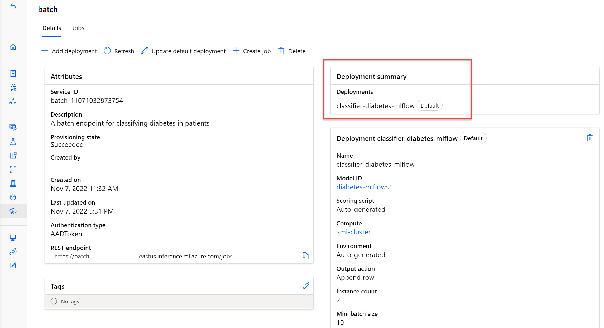

**To deploy an MLflow model to a batch endpoint, you can use the following code:**
```python
from azure.ai.ml.entities import BatchDeployment, BatchRetrySettings
from azure.ai.ml.constants import BatchDeploymentOutputAction
deployment = BatchDeployment(
    name="forecast-mlflow",
    description="A sales forecaster",
    endpoint_name=endpoint.name,
    model=model,
    compute="aml-cluster",
    instance_count=2,
    max_concurrency_per_instance=2,
    mini_batch_size=2,
    output_action=BatchDeploymentOutputAction.APPEND_ROW,
    output_file_name="predictions.csv",
    retry_settings=BatchRetrySettings(max_retries=3, timeout=300),
    logging_level="info",
)
ml_client.batch_deployments.begin_create_or_update(deployment)
```
**The scoring script must include two functions:**
- **init()**: Called once at the beginning of the process, so use for any costly or common preparation like loading the model.
- **run()**: Called for each mini batch to perform the scoring.

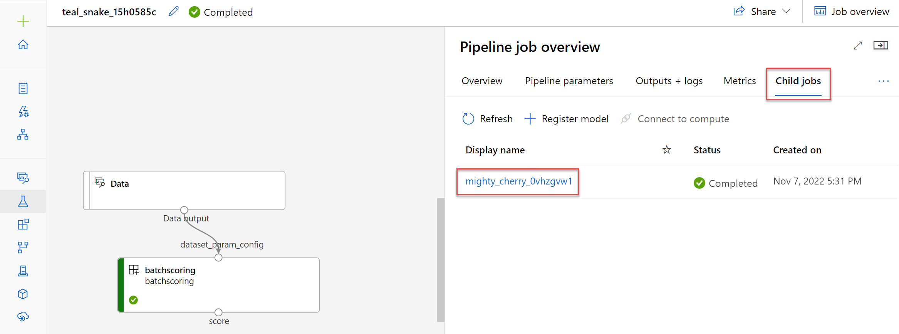

**The logs/user/ folder contains three files that will help you troubleshoot:**
- **job_error.txt**: Summarize the errors in your script.
- **job_progress_overview.txt**: Provides high-level information about the number of mini-batches processed so far.
- **job_result.txt**: Shows errors in calling the init() and run() function in the scoring script.


> *The default deployment will be used to do the actual batch scoring when the endpoint is invoked.*